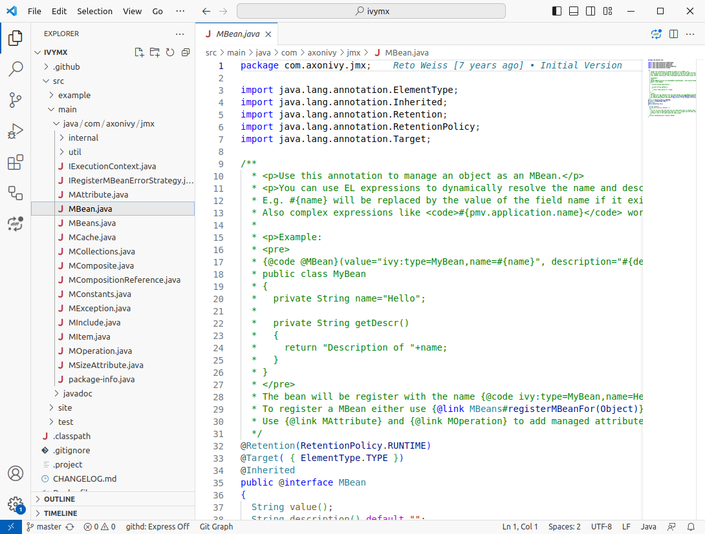
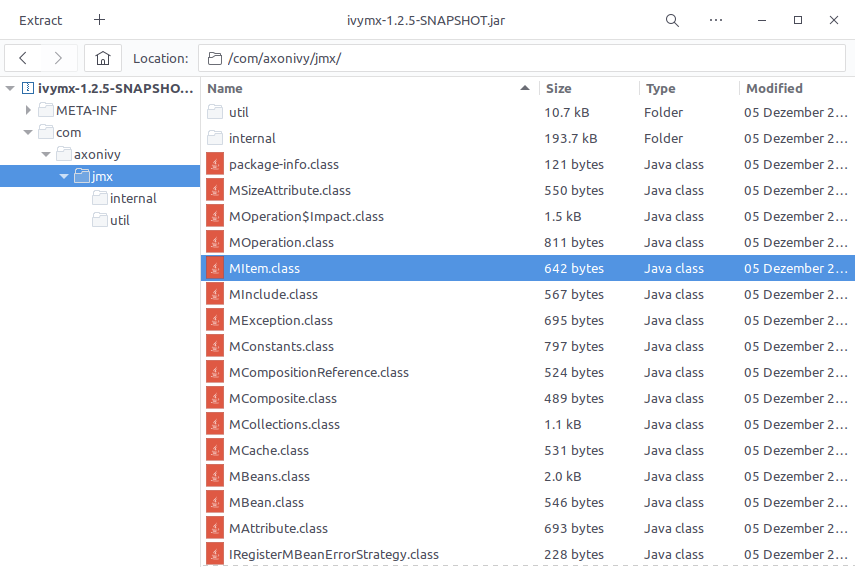
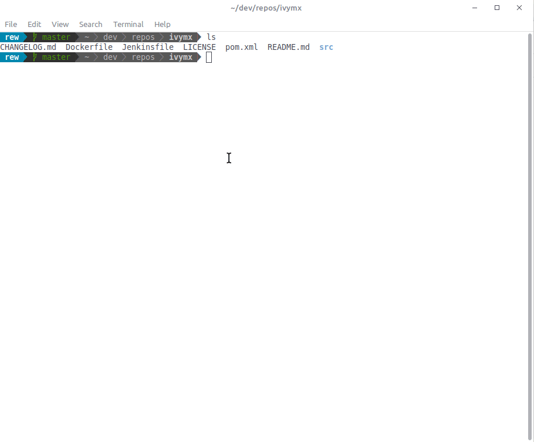
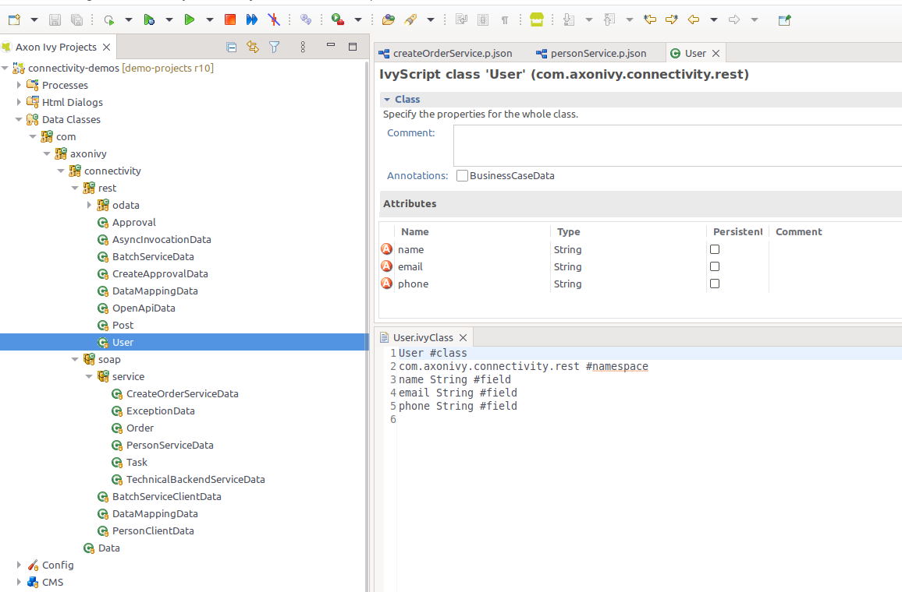
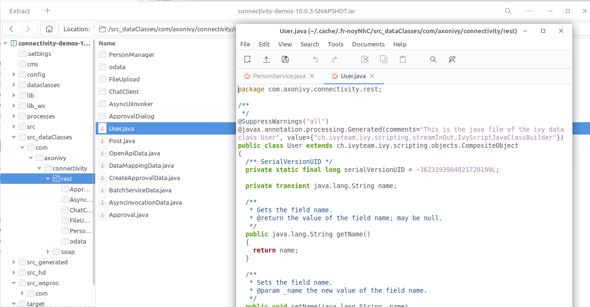
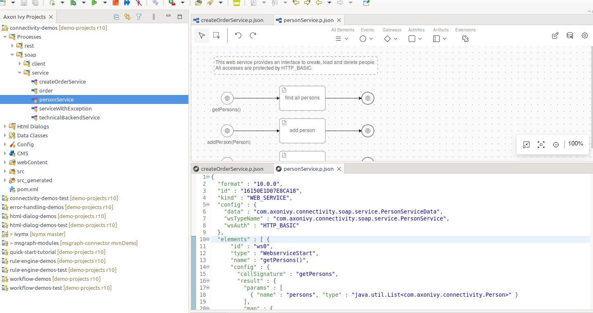
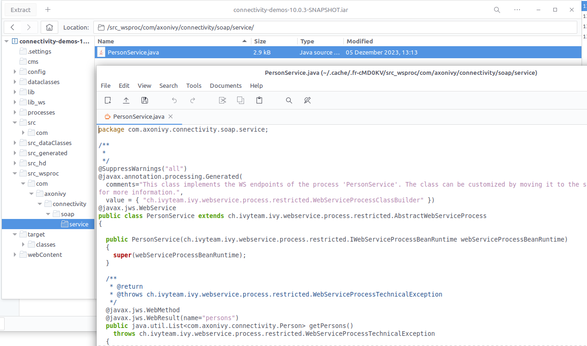

# Maven

A build tool to craft a runtime artifact out of project sources.

`src/*.java` > `target/classes/*.class` > `project-1.0.0-SNAPSHOT.jar`

> runs on every machine; without installing a full blown IDE.

---



---



---



---

## Build receipt

A pom.xml defines what to build with which plugins. It requires nothing but a `groupId` `artifactId` `version` 

Many defaults are automatically applied. 

- the effectice POM reveals the implicitly set configurations

Packaging:

- by default `jar` : other popular formats are `war`, `ejb`
- packaging defines the main target format, plus the lifecycle of the build

## Dependencies

dependent artifacts are declared within the pom.xml.

Dependency resolution:

- fetched from remote; 
  - by default from maven-central
  - locally reachable repos can be added in `repository` sections
- will be cached in local repository `.m2/repository` , therefore resolvable in offline mode in sub-sequent runs
- maven multi-module reactor run

## Lifecycle

- references: [Maven – Introduction to the Build Lifecycle](https://maven.apache.org/guides/introduction/introduction-to-the-lifecycle.html#lifecycle-reference)

- 3 cycles: `clean`, `default`, `site`

- Splitted into phases; that are selected when running the `mvn` binary

- e.g. `mvn clean verify`
  
  - runs the clean lifecycle until the `clean` phase
  - runs the default lifecycle until the `verify` phase

- plugins are bound to lifecycle-phases;
  
  - defining their plugin `goals` to run

# Project-build-plugin

Builds ivy-projects for ivy-engines!

## packaging format

We maintain our own Ivy-Archvie (.iar) format for projects:

- an IAR file: the source project + compiled artifacts as zip.
- we consume resources, such as p.json process files, at runtime.
- we have one packed format that can be consumed by the engine an the Designer a like. So we keep the files where they are ... and do not copy it into a META-INF resources dir.

---

To make Maven aware of our custom packaging, we need provide an extension-plugin, that knows how to craft `iar` natured projects:

```xml
  <packaging>iar</packaging>
  <build>
    <plugins>
      <plugin>
        <groupId>com.axonivy.ivy.ci</groupId>
        <artifactId>project-build-plugin</artifactId>
        <version>10.0.14</version>
        <!--extension informs maven; that this plugin supplies custom packaging formats -->
        <extensions>true</extensions>
      </plugin>
    </plugins>
  </build>
```

## Source-generators

During the build of an IvyProject multiple builders generate sources:

### DataClasses:

- are defined in our custom `.ivyClass` format.
  

----  

- a builder will generate a java source file out of it. (which afterwards will be compiled)
  

### WebServiceProcess (SOAP):

- are define with processes `*.p.json` files with `kind: WEB_SERVICE`
  

---    

- a builder will generate a java file, defining jax-ws service endpoint for it
  

## Compilation

after having all java sources generated; the project-build-plugin compiles the sources as .class files:

1. JDTCompiler is being used to compile java files, not `javac`
   1. `.classpath` + `.settings/org.eclipse.jdt.core.prefs` define the main compiler settings
   2. Maven `pom.xml` settings, such as `build/sourceDirectory`, can override native JDT file values

### IvyScript

2. **IvyScript** code expression and blocks are being validated:
   1. Invalid statements are being reported, just like other java sources problems
   2. we invented IvyScript, so we are responsible to maintain a build integration for it.
   3. technically: a process-validation is being run, in order to find invalid statements.

## Dependencies

ivy core JAR artifacts are not distributed to a public maven repository, so the ivy-core classpath must be defined by other means:

### ivyEngine

An ivy-engine is being used to supply core-dependencies.

- it is being fetched from remote; browsing our public listing of available engines
- it's cached locally `.m2/repository/.cache/ivy`
- we enrich the `classpath` of well known maven plugins, such as maven-surefire, to make our special dependencies known.

### m2 Ecosystem

- we can consume any java `jar` from Maven repositories and use it in ivy projects.
- ivy-engines do classically not have a running Maven environment, so the dependent jar's must supply it for deployments onto an engine.
- the build plugin will include it in the generated `*.iar` file.

## Integration-tests

WebTests for the frontend of an IvyApplication naturally require an engine to execute the projects under test.

- the build plugin does automatically start an ivy-engine in the `pre-integration-test` phase
- and stops it again in the `post-integration-test` phase.

## Lifecycles

Defining our own lifecycle, is the key to bind our custom build goals, into the build process, without letting the user re-state ivy-defaults in his project.

[lifecycle-components](https://github.com/axonivy/project-build-plugin/blob/master/src/main/resources/META-INF/plexus/components.xml)

- iar > normal project build run
- iar-integration-test > project containing only test code; needs to boot/stop an engine

## Eclipse integration

Maven 2 Eclipse (m2e) is our integration for the IDE:

- pom.xml editor support
- fetches declared dependencies from remote repos
  - we apply some magic while parsing the pom-dom, to filter dependencies from the Maven-Classpath, that we already have included in our binary IARs
- ... we could also call the project-build-plugin when a project changes; by applying lifecycle-mappings. Today we don't do anything here.

# Examination

Cool:

- We re-use the Eclipse JDT complier from the Designer IDE; no need to develop a special extra build just for Maven.
- Minimal Maven pom.xml configuration required, to build an ivy-project. So it's really low-code friendly, there's no need to get to know Maven in depth.
  - iar-integration-tests are damn simple; no need to configure anything despite the `packaging`
- source-generators can be developed just like anything else, in the ivy-core; without getting to know the Maven universe

---

- we can maintain our special packaging format; no special trick required to re-import a built project, into a workspace ... we're just unpacking a ZIP.
- despite our very custom lifecycle and packaging; users can build advanced builds by overriding our default configurations, and by adding more plugins from the Maven universe.

---

Special:

- to compile projects, we deploy them to an in-memory engine; the engine runs in the project-build-plugin JVM
  
  - bootstrap for this is slow
  - compilation classpath with the project-build-plugin is as open as is can be: everything from the ivy-core can be accessed
  - deployments of projects which are being built are expensive

- many goals require an engine to run
  
  - slow to download on the first attempt
  - custom non maven infrastructure to list available engines on the web.

# Quo Vadis

- The build plugin could/should take over source-generator tasks:
  
  - dataclass generation, webservice generation
  - development libraries, like swagger-codegen, should be consumed from the project-build-plugin stack; an not added to the Designer product.
  - ... the plugin could be called from Eclipse/m2e

---

- Engine downloads should be omitted:
  
  - in the web.ide we could re-use the running engine for compilation tasks
  - also in the legacy Designer, why should we fetch an engine, if we're alredy runnign an ivy product?
  - JAR of the ivy-core should be supplied from a maven-repo; many infrastructure projects do not need to complete core for compilation and could fetch a much smaller footprint.

# Questions?

References: 

[GitHub - axonivy/project-build-plugin](https://github.com/axonivy/project-build-plugin)

[GitHub - example use cases for the project-build-plugin](https://github.com/axonivy/project-build-examples/)

[Axon Ivy Project Build Plugin 11.2](http://axonivy.github.io/project-build-plugin/snapshot/11.2/index.html)
